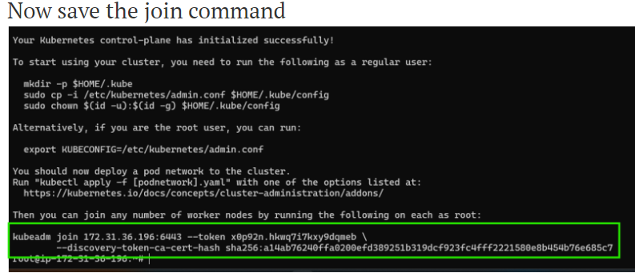
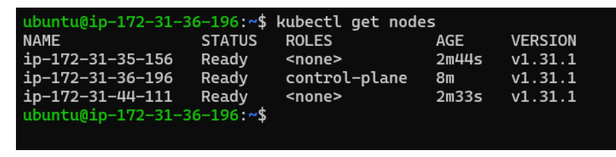

# K8s installation Process

* create 3 ubuntu machine(22.04)
* Give permissions and storage(10gb)
* create security groups give all permissions
* Install docker in all machine
```
  #!/bin/bash
curl -fsSL https://get.docker.com -o install-docker.sh
sh install-docker.sh
```
* Installing CRI-dockerd on all nodes
```
* cd /tmp
wget https://github.com/Mirantis/cri-dockerd/releases/download/v0.3.15/cri-dockerd_0.3.15.3-0.ubuntu-jammy_amd64.deb
sudo dpkg -i cri-dockerd_0.3.15.3-0.ubuntu-jammy_amd64.deb)
```
* Install kubeadm, kubectl, kubelet on all nodes 
```
sudo apt-get update
# apt-transport-https may be a dummy package; if so, you can skip that package
sudo apt-get install -y apt-transport-https ca-certificates curl gpg
curl -fsSL https://pkgs.k8s.io/core:/stable:/v1.31/deb/Release.key | sudo gpg --dearmor -o /etc/apt/keyrings/kubernetes-apt-keyring.gpg
echo 'deb [signed-by=/etc/apt/keyrings/kubernetes-apt-keyring.gpg] https://pkgs.k8s.io/core:/stable:/v1.31/deb/ /' | sudo tee /etc/apt/sources.list.d/kubernetes.list
sudo apt-get update
sudo apt-get install -y kubelet kubeadm kubectl
sudo apt-mark hold kubelet kubeadm kubectl
sudo systemctl enable --now kubelet
```
* Now login into master node and initialize the cluster and become a root user
* First become a root user (sudo -i)
```
* kubeadm init --pod-network-cidr=10.244.0.0/16 --cri-socket "unix:///var/run/cri-dockerd.sock"
```



* Lets configure kubectl on master node. become a normal user


* Login into node 1 and execute the join command
* repeat it in node2 also
* Now login into node 1 and execute 

```
kubectl get nodes
```


* To fix the not ready status, we need to install pod network, lets install flannel on master node
 
 ```
  kubectl apply -f https://github.com/coreos/flannel/raw/master/  Documentation/kube-flannel.yml
```
```
kubectl get nodes -w
```




