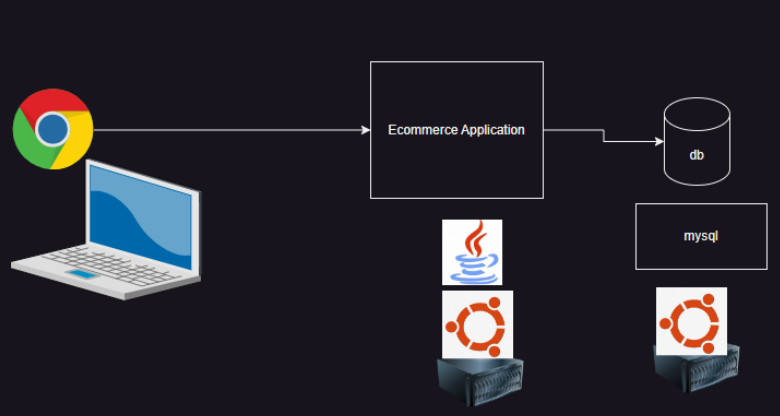

# k8s day 1 
# Story of Kubernetes (k8s)

* Monolithic Systems
* A Monolithic application means that all the parts of app are combined into one big piece. this includes:
    * User Interface : what you see and interract with.
    * Business Logic: the rules and processes that make the app work.
    * DataAccess: How the app gets and save information.

* Advantages:
    * Simple to Build
    * Fast performance
* Disadvantages:
    * Hard to change
    * Diffcult to scale

# Microservices
* Application are broken down into individually runnable services.
* Google has wriiten orchestation system based on thier experince with containers in Golang which is called as Kubernetes and made it open-source.
* Kubernetes is open-source system for automating deployment,scaling and management of containersized applications.
* Running conatiners for production scenarios is what k8s does.

